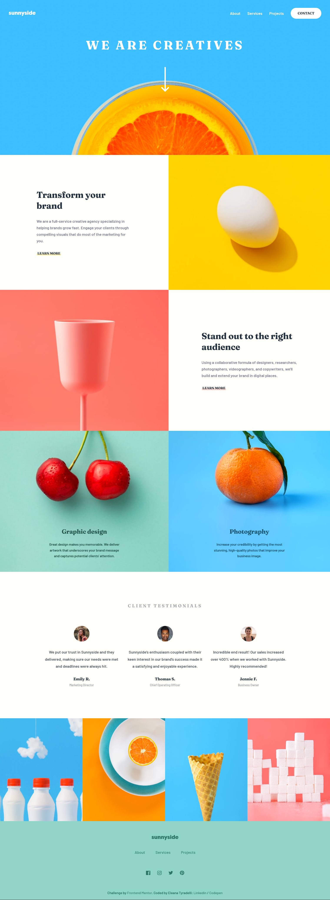
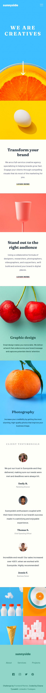
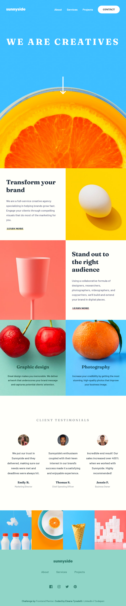

## Table of contents

- [Overview](#overview)
  - [The challenge](#the-challenge)
  - [Screenshot](#screenshot)
  - [Links](#links)
- [My process](#my-process)
  - [Built with](#built-with)
  - [Continued development](#continued-development)
- [Author](#author)

## Overview

Hello! Thanks for visiting. I'm Eleana and I'm a Junior Frontend Developer from Greece.

This is my solution to the [Sunnyside agency landing page challenge on Frontend Mentor](https://www.frontendmentor.io/challenges/sunnyside-agency-landing-page-7yVs3B6ef). Frontend Mentor challenges help you improve your coding skills by building realistic projects.

### The challenge

Users should be able to:

- View the optimal layout for the site depending on their device's screen size
- See hover states for all interactive elements on the page

### Screenshot

### Links

- Live Site URL: [GitHub Pages](https://etyradelli.github.io/sunnyside-agency-frontend-mentor-challenge/)

## My process

I followed an HTML desktop-first / CSS mobile-first approach. Specifically for CSS, I used a combination of BEM, utility classes and custom variables. I also used a little JS for the mobile menu toggle. This project proved to be a good practice for Grid and Flexbox layout structure.

### Built with

- Semantic HTML5 markup
- CSS custom properties
- Vanilla JavaScript
- Flexbox
- CSS Grid
- Mobile-first workflow

### Continued development

Next update on this project will fix accessibility issues.

## Author

Hi, my name is Eleana and I'm a Junior Frontend Developer. 
Feel free to connect with me on Linkedin and say hi :)

- Linkedin - [Eleana Tyradelli](https://www.linkedin.com/in/eleanatyradelli/)
- Codepen - [@eTyradelli](https://codepen.io/eTyradelli)
- Frontend Mentor - [@eTyradelli](https://www.frontendmentor.io/profile/eTyradelli)
